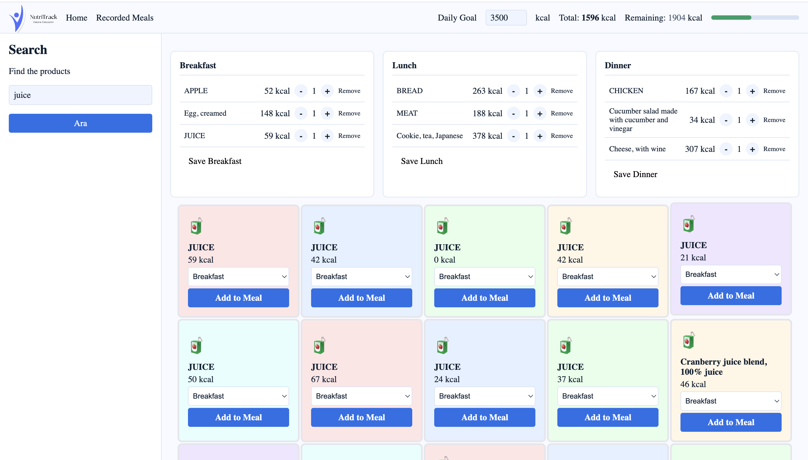
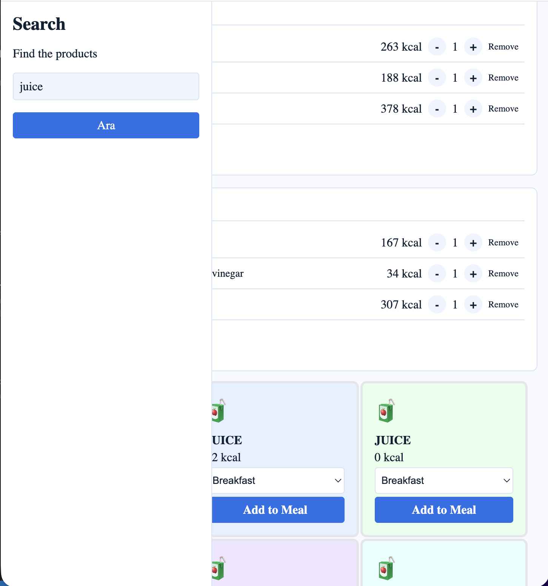
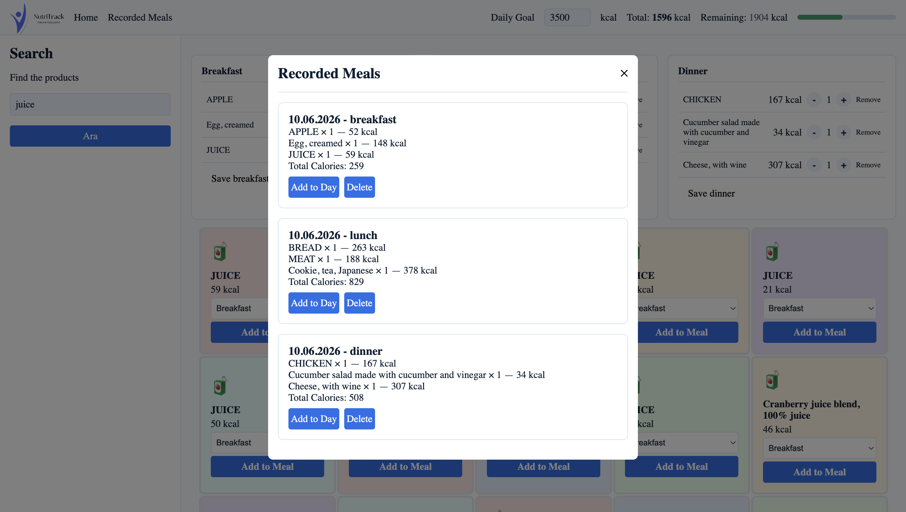

1. Copy the config.example.js file.
2. Rename it to config.js.
3. Add the API key.

# NutriTrack — Calorie Calculator

A responsive, accessible daily calorie tracking web application built with Vanilla JavaScript, HTML, and CSS — no frameworks, no libraries.

---

## Features

- **Food Search** — Search thousands of foods using the USDA FoodData Central API with debounced input for optimized performance
- **Meal Tracking** — Add foods to Breakfast, Lunch, or Dinner with quantity controls (+/-)
- **Daily Goal** — Set a personalized daily calorie target and track your progress in real time
- **Progress Bar** — Visual indicator that changes color based on your calorie intake (green → orange → red)
- **Recorded Meals** — Save and revisit past meals, and re-add them to your current day with one click
- **LocalStorage** — All data persists across sessions without a backend
- **Responsive Design** — Fully functional on both desktop and mobile with a slide-out sidebar
- **Accessibility** — 100% Lighthouse accessibility score with ARIA labels, live regions, and keyboard navigation

---

## Tech Stack

- **HTML5** — Semantic markup, ARIA attributes
- **CSS3** — CSS Grid, Flexbox, Custom Properties (variables), Media Queries
- **JavaScript (ES6+)** — Fetch API, async/await, LocalStorage, Event Delegation, Debounce
- **USDA FoodData Central API** — Free, reliable nutritional data

---

## Getting Started

### 1. Clone the repository

```bash
git clone https://github.com/your-username/nutritrack.git
cd nutritrack
```

### 2. Get a free API key

Go to [https://fdc.nal.usda.gov/api-key-signup.html](https://fdc.nal.usda.gov/api-key-signup.html) and sign up for a free API key.

### 3. Configure your API key

```bash
cp js/config.example.js js/config.js
```

Open `js/config.js` and replace `BURAYA_API_KEY_EKLE` with your API key:

```javascript
const CONFIG = {
  BASE_URL: 'https://api.nal.usda.gov/fdc/v1/foods',
  API_KEY: 'YOUR_API_KEY_HERE',
  ENDPOINTS: {
    search: '/search',
  },
};
```

### 4. Open with Live Server

Open `index.html` with [Live Server](https://marketplace.visualstudio.com/items?itemName=ritwickdey.LiveServer) in VS Code or any local development server.

> ⚠️ `config.js` is listed in `.gitignore` — never commit your API key.

---

## Project Structure

```
nutritrack/
├── index.html
├── .gitignore
├── README.md
├── assets/
│   └── logo-3.svg / logo-2.svg
├── css/
│   ├── reset.css
│   ├── variables.css
│   ├── component.css
│   ├── layout.css
│   └── responsive.css
└── js/
    ├── config.example.js
    ├── config.js          ← not committed
    ├── api.js
    ├── storage.js
    ├── calculator.js
    ├── ui.js
    └── app.js
```

---

## Key Concepts Demonstrated

| Concept                      | Where                 |
| ---------------------------- | --------------------- |
| Fetch API + async/await      | `api.js`              |
| Debounce pattern             | `app.js`              |
| Event delegation             | `app.js`              |
| LocalStorage CRUD            | `storage.js`          |
| Pure functions               | `calculator.js`       |
| DOM manipulation             | `ui.js`               |
| CSS Grid template-areas      | `layout.css`          |
| ARIA + screen reader support | `index.html`, `ui.js` |
| Separation of concerns       | All JS files          |

---

## Screenshots

> 
> 
> 

---

## License

This project is open source and available under the [MIT License](LICENSE).

---

---

# NutriTrack — Kalori Hesaplayıcı

Vanilla JavaScript, HTML ve CSS ile — hiçbir framework veya kütüphane kullanılmadan — geliştirilmiş, responsive ve erişilebilir bir günlük kalori takip uygulaması.

---

## Özellikler

- **Besin Arama** — USDA FoodData Central API ile binlerce besini ara; debounce ile optimize edilmiş arama deneyimi
- **Öğün Takibi** — Besinleri Kahvaltı, Öğle veya Akşam yemeğine ekle; miktar kontrolü (+/-) ile yönet
- **Günlük Hedef** — Kişisel günlük kalori hedefi belirle ve ilerlemeyi anlık takip et
- **İlerleme Çubuğu** — Kalori alımına göre renk değiştiren görsel gösterge (yeşil → turuncu → kırmızı)
- **Kaydedilen Öğünler** — Geçmiş öğünleri kaydet, tek tıkla güncel güne ekle
- **LocalStorage** — Backend olmadan tüm veriler oturum boyunca saklanır
- **Responsive Tasarım** — Masaüstü ve mobilde tam işlevsel; kaydırmalı sidebar
- **Erişilebilirlik** — %100 Lighthouse erişilebilirlik skoru; ARIA etiketleri, canlı bölgeler ve klavye navigasyonu

---

## Kurulum

### 1. Depoyu klonla

```bash
git clone https://github.com/kullanici-adin/nutritrack.git
cd nutritrack
```

### 2. Ücretsiz API anahtarı al

[https://fdc.nal.usda.gov/api-key-signup.html](https://fdc.nal.usda.gov/api-key-signup.html) adresinden ücretsiz API anahtarı al.

### 3. API anahtarını yapılandır

```bash
cp js/config.example.js js/config.js
```

`js/config.js` dosyasını aç ve `BURAYA_API_KEY_EKLE` kısmını kendi anahtarınla değiştir.

### 4. Live Server ile aç

VS Code'da [Live Server](https://marketplace.visualstudio.com/items?itemName=ritwickdey.LiveServer) eklentisiyle `index.html` dosyasını aç.

> ⚠️ `config.js` dosyası `.gitignore`'a eklidir — API anahtarını asla commit etme.
